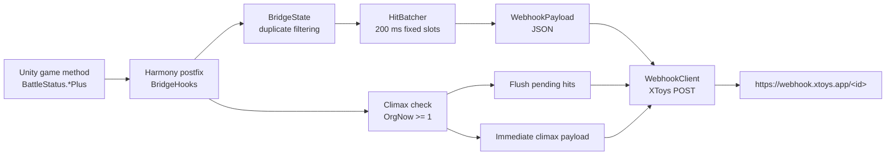

# Dominate Plan XToys Bridge Handoff

Last updated: 2026-07-01

This document is the handoff context for continuing the `ドミネートプラン` XToys bridge work in a new session.

## Current Goal

Port the original RPG Maker MZ XToys bridge idea from `レピテーション！_ver1.01/js/plugins/XtoysBridgeMZ.js` to the Unity game `ドミネートプラン`.

The current target is a practical BepInEx plugin workflow:

- Install BepInEx into `ドミネートプラン`.
- Put only the formal bridge DLL into `ドミネートプラン/BepInEx/plugins`.
- Configure the XToys webhook ID in game with the F8 panel.
- Send real XToys webhook POSTs for body-part hits and climax events.
- Keep the probe plugin separate and optional for future diagnostics.

## Key Decisions

### Formal Bridge And Probe Are Separate

The formal bridge is the normal runtime plugin:

- Project: `src/DominatePlanBridge.BepInEx`
- Assembly: `XtoysBridgeDominatePlan.dll`
- Runtime log: `ドミネートプラン/xtoys_dominate_bridge_log.txt`
- BepInEx plugin GUID: `local.xtoys.dominateplan.bridge`

The probe is only for diagnostics:

- Project: `src/DominatePlanProbe.BepInEx`
- Assembly: `XtoysProbeDominatePlan.dll`
- Runtime log: `ドミネートプラン/xtoys_dominate_probe_log.txt`
- BepInEx plugin GUID: `local.xtoys.dominateplan.probe`

The formal bridge project links the required core source files directly, so the game plugin folder does not need `DominatePlanBridge.Core.dll`.

### Deployment Target

The intended ordinary deployment is:

```text
ドミネートプラン/
  BepInEx/
    plugins/
      XtoysBridgeDominatePlan.dll
```

The optional probe DLL should not be placed there unless actively diagnosing game internals.

### Webhook Configuration

The bridge has an in-game IMGUI settings panel:

- Toggle: F8
- Fields:
  - webhook ID or full `https://webhook.xtoys.app/<id>` URL
  - `Enable Dispatch`
- Buttons:
  - `Save`
  - `Test`
  - `Close`

The webhook ID is normalized before saving:

- bare ID is accepted
- full XToys webhook URL is accepted
- trailing slashes and query strings are removed

Dispatch is disabled by default. The user enables it after entering the webhook ID.

### Hit Event Strategy

The game can produce very dense attack events, so individual hit events are merged into a short fixed-slot batch.

Current timing:

- hit duplicate cooldown per source: `50 ms`
- hit batch window: `200 ms`
- climax duplicate window: `1000 ms`
- successful POST status log aggregation: `5000 ms`

Within one batch window, each body part keeps the latest known metrics. Missing parts are emitted as JSON `null`, because this makes XToys-side conditional logic simpler.

### Body Part Order

The fixed slot protocol is:

```text
part1 = mouth
part2 = chest
part3 = lower
part4 = butt
```

This order is intentionally stable even when only one or two parts were hit.

### Part Value Is Not Critical

The user confirmed `partValue` is not important for output control. It is still included when available, but XToys-side output is expected to use `partPercent`.

### EP Is Ignored For This Port

The original RPG Maker bridge had EP-related logic. For `ドミネートプラン`, EP is not part of the active bridge behavior.

### Climax Is Immediate

Climax events are sent normally and are not used to lock out later hit output. The game can attack rapidly, and a lockout could drop useful hit batches.

When a climax is detected, the bridge flushes any pending hit batch first, then sends the climax payload.

## Runtime Event Mapping

The confirmed Unity methods and fields are:

| Game source | Bridge part | Value field | Percent UI marker |
| --- | --- | --- | --- |
| `BattleStatus.KuchiPlus` | `mouth` | `KuchiSt` | `Ku_H/Num` |
| `BattleStatus.MunePlus` | `chest` | `MuneSt` | `Mu_H/Num` |
| `BattleStatus.KabuPlus` | `lower` | `KabuSt` | `Ka_H/Num` |
| `BattleStatus.KethuPlus` | `butt` | `KethuSt` | `Ke_H/Num` |

Additional core mapping exists for `BattleStatus.HigyakuPlus -> abuse`, but the formal bridge currently hooks only the four body-part methods above.

Climax detection currently checks `OrgNow >= 1` on the `BattleStatus` instance after a hooked part method runs. The bridge maintains its own climax count.

## Webhook Payload Protocol

### Batched Hit Payload

The formal bridge sends batched hit payloads with fixed part slots:

```json
{
  "action": "hit",
  "batched": true,
  "windowMs": 200,
  "part1": "mouth",
  "partValue1": 1234,
  "partPercent1": 12.5,
  "part2": null,
  "partValue2": null,
  "partPercent2": null,
  "part3": "lower",
  "partValue3": 5678,
  "partPercent3": 45,
  "part4": null,
  "partValue4": null,
  "partPercent4": null
}
```

Important protocol rules:

- `partN` is either the fixed part name or `null`.
- `partValueN` is either the latest observed numeric value or `null`.
- `partPercentN` is either the latest observed percentage or `null`.
- The slot order never changes.
- If the same part is hit multiple times inside the 200 ms batch window, the latest metrics win.

### Climax Payload

Climax payloads are immediate:

```json
{
  "action": "climax",
  "part": "orgasm",
  "climaxCount": 1
}
```

### Test Payload

The F8 panel `Test` button sends:

```json
{
  "action": "test",
  "source": "dominate_plan_bridge"
}
```

## Overall Architecture



Primary responsibilities:

- `Plugin.cs`: BepInEx lifecycle, config, F8 panel, Harmony patch setup, batch flushing, log reset.
- `BridgeHooks.cs`: Unity method postfix handling, part mapping, value/percent reads, climax detection.
- `WebhookClient.cs`: JSON dispatch, real POST, last status, 5-second POST 200 summary logs.
- `HitBatcher.cs`: fixed 200 ms hit batch window and part-slot storage.
- `WebhookPayload.cs`: JSON shape for hit, batched hit, climax, and test-related payload handling.
- `BridgeState.cs`: hit cooldown and climax duplicate filtering.
- `WebhookIdNormalizer.cs`: bare ID/full URL normalization.
- `PostStatusAggregator.cs`: successful POST log aggregation.

## Source Layout

```text
src/
  DominatePlanBridge.Core/
    BridgeConfig.cs
    BridgeState.cs
    HitBatcher.cs
    HitBatchSlot.cs
    PartMapper.cs
    PostStatusAggregator.cs
    WebhookIdNormalizer.cs
    WebhookPayload.cs

  DominatePlanBridge.BepInEx/
    DominatePlanBridge.BepInEx.csproj
    Plugin.cs
    WebhookClient.cs
    Hooks/
      BridgeHooks.cs
      ProbeHooks.cs
      ProbeSnapshot.cs
      ProbeNameFilter.cs

  DominatePlanProbe.BepInEx/
    DominatePlanProbe.BepInEx.csproj
    ProbePlugin.cs

tests/
  DominatePlanBridge.Core.Tests/
    Program.cs
```

Notes:

- `ProbeHooks.cs`, `ProbeSnapshot.cs`, and `ProbeNameFilter.cs` physically remain under the bridge project folder, but the formal bridge `.csproj` excludes the probe hook files.
- The probe `.csproj` links the probe hook sources.
- Core files are still kept as a testable library, and the formal bridge links them as source to avoid a second required runtime DLL.

## Logs

Formal bridge log:

```text
ドミネートプラン/xtoys_dominate_bridge_log.txt
```

Probe log:

```text
ドミネートプラン/xtoys_dominate_probe_log.txt
```

Both logs are reset when their respective plugin starts.

Bridge log line examples:

```text
[READY] Xtoys Dominate Plan Bridge ready. dispatch=True webhook configured=True
[HOOK] bridge BattleStatus.KuchiPlus
[PAYLOAD] {"action":"hit","batched":true,...}
[POST] 200 x38 in 5s
```

`POST 200 xN in 5s` means N successful webhook POSTs were summarized over a five-second interval. This replaced high-frequency individual `POST 200` log spam.

## Build And Verification Commands

Run from the repository root:

```powershell
dotnet run --project tests\DominatePlanBridge.Core.Tests\DominatePlanBridge.Core.Tests.csproj
dotnet build src\DominatePlanBridge.BepInEx\DominatePlanBridge.BepInEx.csproj -c Release
dotnet build src\DominatePlanProbe.BepInEx\DominatePlanProbe.BepInEx.csproj -c Release
```

Expected current results:

```text
All tests passed
0 warnings
0 errors
```

Check that the formal bridge has no runtime dependency on `DominatePlanBridge.Core.dll`:

```powershell
Select-String -LiteralPath src\DominatePlanBridge.BepInEx\bin\Release\netstandard2.0\XtoysBridgeDominatePlan.deps.json -Pattern 'DominatePlanBridge.Core'
```

Expected result: no output.

Check the game plugin folder:

```powershell
Get-ChildItem -LiteralPath 'ドミネートプラン\BepInEx\plugins'
```

Expected ordinary deployment: only `XtoysBridgeDominatePlan.dll` is required.

## Current Verified State

Latest verified state before this handoff:

- Core tests passed.
- Formal bridge Release build passed.
- Probe Release build passed.
- Formal bridge `.deps.json` had no `DominatePlanBridge.Core` dependency.
- The game plugin folder was cleaned so ordinary runtime only needs `XtoysBridgeDominatePlan.dll`.

Runtime behavior observed by the user:

- Batched hit protocol ran normally.
- Real POSTs reached XToys successfully.
- High-frequency attacks were the reason for the 200 ms hit batch window and 5-second POST summary logging.

## Practical Next-Session Workflow

1. Read this file first.
2. Inspect current source only where needed:
   - `src/DominatePlanBridge.BepInEx/Plugin.cs`
   - `src/DominatePlanBridge.BepInEx/Hooks/BridgeHooks.cs`
   - `src/DominatePlanBridge.BepInEx/WebhookClient.cs`
   - `src/DominatePlanBridge.Core/HitBatcher.cs`
   - `src/DominatePlanBridge.Core/WebhookPayload.cs`
3. If changing behavior, update or add core tests first.
4. Build the formal bridge and probe if source layout changes.
5. Copy only `XtoysBridgeDominatePlan.dll` into `ドミネートプラン/BepInEx/plugins` for normal runtime.
6. Use the probe DLL only if the game internals need to be rediscovered.
7. Ask for approval before launching the game GUI from the terminal.

## Open Follow-Up Ideas

- Create a small `dist/` package with:
  - bridge DLL
  - optional probe DLL
  - short install README
- Add a build/copy script for release packaging.
- Consider adding configurable batch window controls to the F8 panel if 200 ms needs tuning without editing the config file.
- Consider logging payload totals per 5 seconds if XToys-side congestion needs more visibility.

