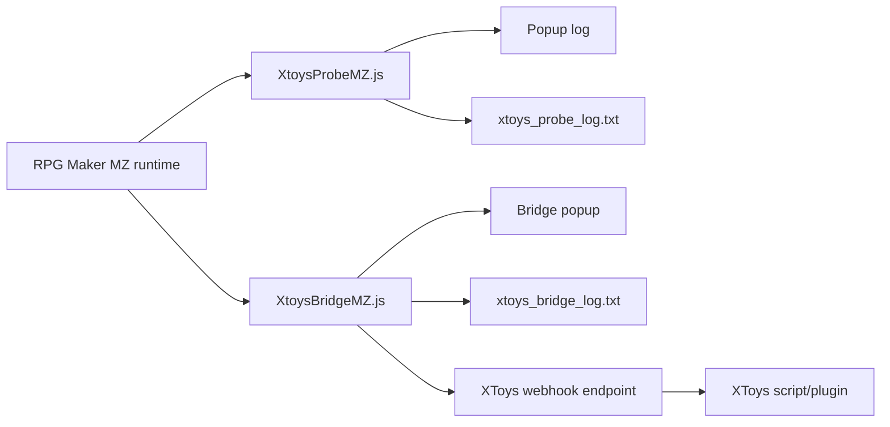

# Xtoys WS Plugin Project Handoff

Last updated: 2026-06-30  
Workspace: `C:\Users\HatoriKanon\Claude\Projects\Xtoys-ws-plugin`

This document is the compact context snapshot for continuing the project in a new Codex session. Start by reading this file, then inspect the files listed in "Important Files".

## Project Goal

Build a reusable workflow for connecting RPG Maker games to XToys through webhooks.

Current focus:

- Use the original `XtoysWS.js` from `駆錬輝晶 クォルタ　アルミネス＆タンジェル EG` as the reference implementation.
- Migrate the core idea to `レピテーション！_ver1.01`.
- Detect in-game events such as body-part EP hits, EP strength, restraint stage, and climax.
- Send small webhook payloads that are easy to consume from XToys scripts.
- Keep probing/debugging separate from the production bridge.

## Games And Engines

### Original Reference Game

Path:

```text
駆錬輝晶 クォルタ　アルミネス＆タンジェル EG
```

Engine:

- RPG Maker MV style layout.
- Uses `www/js/rpg_core.js`, `www/js/rpg_objects.js`, `www/js/plugins.js`.
- Original XToys reference plugin:

```text
駆錬輝晶 クォルタ　アルミネス＆タンジェル EG/www/js/plugins/XtoysWS.js
```

Reference behavior:

- Webhook communication with XToys.
- Runtime popup for webhook ID and logs.
- Battle slowdown support was present but is secondary to this project.
- Original plugin is game-specific and should not be copied directly into MZ games without adaptation.

### Current Target Game

Path:

```text
レピテーション！_ver1.01
```

Engine:

- RPG Maker MZ.
- `package.json` name is `rmmz-game`.
- Uses `js/rmmz_core.js`, `js/rmmz_objects.js`, `js/plugins.js`.
- Window title is `レピテーション！`.

Current custom plugins:

```text
レピテーション！_ver1.01/js/plugins/XtoysProbeMZ.js
レピテーション！_ver1.01/js/plugins/XtoysBridgeMZ.js
```

Both are registered in:

```text
レピテーション！_ver1.01/js/plugins.js
```

## Current Workflow

1. Identify the engine and file layout.
   - MV usually has `www/js/rpg_*.js`.
   - MZ usually has `js/rmmz_*.js`.

2. Create or enable a probe plugin.
   - Hook `Game_Switches.prototype.setValue`.
   - Hook `Game_Variables.prototype.setValue`.
   - Hook battle action/state changes where useful.
   - Write both popup logs and file logs.

3. Play through target scenes and gather logs.
   - Trigger one behavior at a time where possible.
   - Look for stable switch/variable/state/action changes.
   - Prefer counters and state variables over animation-only effects.

4. Analyze logs and extract mappings.
   - Body-part switches.
   - EP variables.
   - Restraint variables/switches.
   - Climax counters.
   - Optional status systems such as hypnosis/brainwash.

5. Implement the bridge plugin.
   - Keep bridge logic minimal.
   - Use stable variable/switch changes as event sources.
   - Send small JSON payloads to XToys.
   - Keep logs for local debugging.

6. Slim the webhook protocol after the mapping is stable.
   - Remove fields that XToys scripts do not need.
   - Keep the payload action-oriented.

## Key Decisions

- Probe and bridge are separate plugins.
  - `XtoysProbeMZ.js` is for discovery.
  - `XtoysBridgeMZ.js` is for normal gameplay integration.

- The target game uses RPG Maker MZ, so the bridge was written as an MZ plugin instead of porting the MV plugin directly.

- Runtime popup windows must suppress native right-click context menus.
  - Selecting text and right-clicking inside earlier popups could crash the game.
  - Current popup code prevents the native `contextmenu` and copies selected text instead.

- Body-part EP detection is based on switches `#83..#94`.
  - `#83 汎用EP攻撃中` was originally missed and later added as `generic_ep`.

- Climax detection uses `#112 絶頂経験` increasing.
  - This was more reliable than trying to infer climax from EP stock alone.
  - `XtoysBridgeMZ` has a climax lock window to avoid duplicate sends.

- Hypnosis/brainwash was analyzed but is not currently sent to XToys.
  - The user decided hypnosis fields are not useful for toy scripts right now.
  - The knowledge is preserved below for future use.

- Webhook payloads were slimmed for bandwidth.
  - Removed common `game`, `actor`, and `timestamp`.
  - Removed labels, switch IDs, variant/debug fields, and hypnosis payloads.

## Confirmed Game Mappings

### Body-Part EP Switches

These switches turn on when an EP/body-part attack begins. The bridge sends `hit` when they change from `false` to `true`.

| Switch | In-Game Name | Bridge `part` |
| --- | --- | --- |
| `#83` | `汎用EP攻撃中` | `generic_ep` |
| `#84` | `胸EP攻撃中` | `chest` |
| `#85` | `乳首EP攻撃中` | `nipple` |
| `#86` | `陰唇EP攻撃中` | `labia` |
| `#87` | `クリEP攻撃中` | `clit` |
| `#88` | `膣EP攻撃中` | `vagina` |
| `#89` | `口EP攻撃中` | `mouth` |
| `#90` | `腋EP攻撃中` | `armpit` |
| `#91` | `お尻EP攻撃中` | `butt` |
| `#92` | `両穴EP攻撃中` | `double_hole` |
| `#93` | `突起EP攻撃中` | `protrusion` |
| `#94` | `全身EP攻撃中` | `whole_body` |

### EP And Climax Variables

| Variable | Name | Current Use |
| --- | --- | --- |
| `#29` | `絶頂までのEPストック` | Bridge sends `ep` when this increases. |
| `#39` | `1ターンEP合計` | Observed as per-turn EP amount; not sent now. |
| `#40` | Current/displayed EP mirror | Observed, not sent now. |
| `#112` | `絶頂経験` | Bridge sends `climax` when this increases. |
| `#113` | Lewdness/status value | Observed, not sent now. |

### Experience Counters

These were useful for understanding logs but are not sent in the slim protocol.

| Variable | Name |
| --- | --- |
| `#102` | `胸経験` |
| `#103` | `乳首経験` |
| `#104` | `陰唇経験` |
| `#105` | `クリ経験` |
| `#106` | `膣経験` |
| `#107` | `口経験` |
| `#108` | `腋経験` |
| `#109` | `尻経験` |
| `#110` | `H攻撃経験` |
| `#111` | `自慰経験`; seen before `#83 汎用EP攻撃中` |

### Restraint

| ID | Name | Current Use |
| --- | --- | --- |
| Variable `#24` | `拘束段階` | Bridge sends `restraint` when it changes. |
| Switch `#44` | Restraint on | Observed, not sent now. |
| Switch `#45` | Restraint attack allowed | Observed, not sent now. |
| Switch `#46` | EP attack allowed | Observed, not sent now. |

### Hypnosis/Brainwash Knowledge

This was confirmed from probe logs but is currently unused by `XtoysBridgeMZ`.

| ID | Meaning |
| --- | --- |
| Variable `#34` | `催眠段階`; increases `0 -> 1 -> ... -> 6`. |
| Switch `#42` | `催眠状態ON`; used around stages 1-3. |
| Switch `#43` | `洗脳状態ON`; used around stages 4-6. |
| Switch `#50` | `洗脳攻撃許可`; enabled around early hypnosis, disabled at full stage. |
| State `#37` | `催眠LV1` |
| State `#38` | `催眠LV2` |
| State `#39` | `催眠LV3` |
| State `#40` | `洗脑LV1` |
| State `#41` | `洗脑LV2` |
| State `#42` | `洗脑LV3` |
| Variable `#88` | Hypnosis experience counter. |
| Variable `#91` | Hypnosis attack sub-result; noisy but changes near successful progress. |

Observed hypnosis skill IDs included `#241 手部催眠攻击` and `#246 面纱催眠攻击`.

## Current Webhook Protocol

Endpoint:

```text
POST https://webhook.xtoys.app/<Webhook ID>
Content-Type: application/json
```

The Webhook ID is currently blank in `plugins.js` by default and can be entered from the bridge popup at runtime.

### `hit`

Sent when a body-part EP switch turns on.

```json
{
  "action": "hit",
  "part": "chest"
}
```

Use on XToys side:

- Choose body/channel/script branch based on `part`.
- This is a start signal, not the final EP strength.

### `ep`

Sent when variable `#29` increases.

```json
{
  "action": "ep",
  "part": "chest",
  "epGain": 12,
  "epStock": 47
}
```

Use on XToys side:

- `epGain` is best for one-shot intensity.
- `epStock` is best for buildup curves near climax.
- `part` is the most recent hit part remembered by the bridge.

### `restraint`

Sent when variable `#24` changes.

```json
{
  "action": "restraint",
  "stage": 2
}
```

Use on XToys side:

- Change mode or base intensity by restraint stage.

### `climax`

Sent when variable `#112` increases.

```json
{
  "action": "climax",
  "part": "vagina",
  "climaxCount": 3
}
```

Use on XToys side:

- Trigger a climax routine.
- `part` is the most recent hit part.
- `climaxCount` is the cumulative counter.

## Current Architecture



### Probe Plugin

`XtoysProbeMZ.js` responsibilities:

- Observe variables, switches, states, and actions.
- Show logs in a draggable popup.
- Write logs to `xtoys_probe_log.txt`.
- Allow copying popup text without triggering the native context menu crash.
- Used for discovery, not intended as the final minimal runtime dependency.

### Bridge Plugin

`XtoysBridgeMZ.js` responsibilities:

- Hook `Game_Switches.prototype.setValue` for body-part hit starts.
- Hook `Game_Variables.prototype.setValue` for EP, restraint, and climax.
- Maintain `lastPart` so `ep` and `climax` can include the latest part.
- Send small JSON payloads to XToys.
- Provide a popup for entering Webhook ID and copying local send logs.
- Write logs to `xtoys_bridge_log.txt`.

Important current bridge internals:

- `partMap` starts around `XtoysBridgeMZ.js:76`.
- `send()` starts around `XtoysBridgeMZ.js:165`.
- `sendHit()` starts around `XtoysBridgeMZ.js:204`.
- `sendEp()` starts around `XtoysBridgeMZ.js:217`.
- `sendRestraint()` starts around `XtoysBridgeMZ.js:229`.
- `sendClimax()` starts around `XtoysBridgeMZ.js:236`.
- Runtime hooks start around `XtoysBridgeMZ.js:325`.

## Important Files

### Current Target Game

```text
レピテーション！_ver1.01/js/plugins/XtoysProbeMZ.js
レピテーション！_ver1.01/js/plugins/XtoysBridgeMZ.js
レピテーション！_ver1.01/js/plugins.js
レピテーション！_ver1.01/xtoys_probe_log.txt
レピテーション！_ver1.01/xtoys_bridge_log.txt
レピテーション！_ver1.01/package.json
```

### Original Reference Game

```text
駆錬輝晶 クォルタ　アルミネス＆タンジェル EG/www/js/plugins/XtoysWS.js
駆錬輝晶 クォルタ　アルミネス＆タンジェル EG/www/js/plugins/BattleSlowDown.js
駆錬輝晶 クォルタ　アルミネス＆タンジェル EG/www/js/plugins.js
駆錬輝晶 クォルタ　アルミネス＆タンジェル EG/www/package.json
```

### Workspace Root Utilities

```text
XtoysLOG.js
XtoysLOG_v2.1.js
XtoysLOG_v3.2.js
BattleSlowDown.js
```

These root-level files are references/backups and should not be assumed to be active in the target game unless registered in that game's `plugins.js`.

## Modification Record

### `XtoysProbeMZ.js`

Created as a temporary discovery plugin for `レピテーション！_ver1.01`.

Implemented:

- Variable/switch/state/action logging.
- File log: `xtoys_probe_log.txt`.
- Draggable popup.
- Copy All, Clear, Save Marker, Verbose controls.
- Native right-click suppression to avoid crash when selecting text in popup.

### `XtoysBridgeMZ.js`

Created as the runtime XToys bridge for `レピテーション！_ver1.01`.

Implemented:

- Webhook ID popup.
- File log: `xtoys_bridge_log.txt`.
- Body-part hit detection from switches `#83..#94`.
- EP strength detection from variable `#29`.
- Restraint detection from variable `#24`.
- Climax detection from variable `#112`.
- Climax retry on failed network send.
- Native right-click suppression in popup.
- Slim webhook payloads.

Removed or disabled:

- Hypnosis webhook output.
- Verbose webhook fields such as labels, switch IDs, actor, timestamp, and debug variables.

### `plugins.js`

Current custom registrations:

```text
XtoysProbeMZ   status true
XtoysBridgeMZ  status true
```

`XtoysBridgeMZ` parameters:

```text
Webhook ID: blank by default
Auto Open Panel: true
Hit Cooldown Ms: 120
Climax Lock Ms: 8000
Log To File: true
```

## Verification Commands

Use these after editing the current target game plugins:

```powershell
node --check "レピテーション！_ver1.01\js\plugins\XtoysBridgeMZ.js"
node --check "レピテーション！_ver1.01\js\plugins\XtoysProbeMZ.js"
node --check "レピテーション！_ver1.01\js\plugins.js"
```

Useful static checks:

```powershell
rg -n "send\(\"hit\"|send\(\"ep\"|send\(\"restraint\"|send\(\"climax\"|variableId ===|partMap" "レピテーション！_ver1.01\js\plugins\XtoysBridgeMZ.js"
rg -n "XtoysProbeMZ|XtoysBridgeMZ" "レピテーション！_ver1.01\js\plugins.js"
```

Avoid full `rg --files` unless needed; both game folders contain very large resource trees.

## XToys-Side Script Notes

The XToys script/plugin should dispatch on `action`.

Pseudo-logic:

```js
switch (body.action) {
  case "hit":
    // body.part selects channel or preset
    break;
  case "ep":
    // body.epGain controls immediate intensity
    // body.epStock controls buildup
    break;
  case "restraint":
    // body.stage controls restraint mode
    break;
  case "climax":
    // trigger climax routine
    break;
}
```

Recommended priority if multiple events arrive close together:

1. `climax`
2. `ep`
3. `hit`
4. `restraint`

## Current Status

- The bridge was reported by the user as running normally.
- Current bridge payload is bandwidth-friendly.
- Hypnosis/brainwash is known but intentionally not included in webhook output.
- `#83 汎用EP攻撃中` is included as `generic_ep`.
- Popup right-click crash has been addressed in both probe and bridge.

## Todo

- Build the XToys-side script/plugin using the current slim protocol.
- Test real XToys webhook reception with a configured Webhook ID.
- Decide whether `XtoysProbeMZ` should stay enabled during normal play.
  - Keep it enabled while discovering new mappings.
  - Disable it later to reduce logging/noise.
- If a new game is targeted, repeat the probe-first workflow instead of assuming variable IDs.
- Consider removing unused `label` and `expVar` data from `partMap` if code-level minimalism matters; it does not affect webhook bandwidth.
- Add optional user-facing documentation for configuring the Webhook ID in the bridge popup.

## How To Resume In A New Session

Ask the new assistant to:

1. Read `docs/project-handoff.md`.
2. Inspect `レピテーション！_ver1.01/js/plugins/XtoysBridgeMZ.js`.
3. Inspect `レピテーション！_ver1.01/js/plugins/XtoysProbeMZ.js` only if more discovery work is needed.
4. Continue from the current slim webhook protocol unless the user explicitly asks to expand it.

