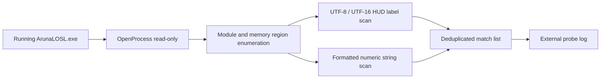

# Aruna External Probe Design

Last updated: 2026-07-01

## Goal

Build a new first-stage diagnostic route for `Aruna and the Labyrinth of SealedLewd1.207` that avoids UE4SS and avoids injecting any DLL into the clean game copy.

The immediate objective is to discover stable runtime data related to the in-game HUD, especially the displayed body-part development values, so a later XToys bridge can be designed from evidence instead of guesses.

## Background

The previous UE4SS route was abandoned for this game because both stable UE4SS `v3.0.1` and `experimental-latest` crashed before any Aruna probe script could run. The crash happened with UE4SS mods disabled and hooks disabled, which points to UE4SS core initialization and missing game-specific signatures rather than the project Lua code.

The user has created a clean replacement game folder:

```text
Aruna and the Labyrinth of SealedLewd1.207/
```

The previously modified copy is isolated as:

```text
Aruna and the Labyrinth of SealedLewd1.207-OLD/
```

The clean copy must remain clean. This design does not copy UE4SS, BepInEx, proxy DLLs, or mod files into the game directory.

## Selected Approach

Create an external Windows console probe:

```text
src/ArunaProbe.External/
  ArunaProbe.External.csproj
  Program.cs
```

The built tool will be:

```text
XtoysArunaExternalProbe.exe
```

It attaches to a running `ArunaLOSL.exe` process using Windows process read APIs. It is read-only: it opens the target process with query/read permissions and never writes memory, creates remote threads, injects modules, patches code, or changes game files.

## HUD Anchor Strategy

The user provided a screenshot showing HUD labels and values that appear to represent player or character state. These labels are likely rendered from runtime data, but the displayed text may be a formatted/cache layer rather than the authoritative source.

The first probe stage will use these labels as anchors:

```text
開発度
口腔
乳房
陰核
フタナリ
尿道
膣
肛門
Core
Shell
Energy
```

The probe will scan readable process memory for UTF-8 and UTF-16LE encodings of these labels and for nearby formatted numeric strings such as:

```text
000.00
9999.0
49990
20/20
8/8
```

Matches are recorded with module/region metadata and offsets. The probe does not assume that nearby strings are the true variables; it only uses them to guide further investigation.

## Probe Responsibilities

The external probe will:

- find running `ArunaLOSL.exe` processes
- choose the newest process by default if multiple are present
- open the process with `PROCESS_QUERY_LIMITED_INFORMATION` and `PROCESS_VM_READ`
- enumerate loaded modules and readable memory regions
- scan committed readable regions for configured UTF-8 and UTF-16LE label patterns
- scan for common formatted numeric HUD strings
- log all findings to a local file
- tolerate inaccessible pages, partial reads, protected memory, and process exit
- never dispatch XToys webhooks
- never modify the target process

## Log Output

Primary log:

```text
Aruna and the Labyrinth of SealedLewd1.207/xtoys_aruna_external_probe_log.txt
```

Fallback log, if the game root cannot be inferred:

```text
logs/xtoys_aruna_external_probe_log.txt
```

Log lines use this shape:

```text
[06:30:12.123] [READY] Xtoys Aruna External Probe ready
[06:30:12.456] [PROCESS] pid=1234 path=...
[06:30:12.789] [MODULE] base=0x... size=... name=ArunaLOSL.exe
[06:30:13.012] [MATCH] encoding=utf16 label=開発度 address=0x... region=...
[06:30:13.345] [NUMBER] text=000.00 address=0x... region=...
[06:30:13.678] [ERROR] ...
```

## Command Line

Initial command behavior:

```text
XtoysArunaExternalProbe.exe scan
```

Optional arguments:

```text
--pid <pid>              Attach to a specific process.
--game-root <path>       Override the game root for log output.
--max-region-mb <n>      Skip huge regions above this size. Default: 256.
--include-numbers        Include formatted numeric string scan. Default: enabled.
--no-numbers             Disable formatted numeric string scan.
```

If no arguments are supplied, the tool behaves as `scan`.

## Data Flow



## Safety Rules

The tool must not:

- install files into the game folder other than its own log
- inject DLLs
- call `WriteProcessMemory`
- call `CreateRemoteThread`
- patch executable code
- send network requests
- require administrator rights unless Windows denies normal read access

Any future feature that would write to the process or dispatch to XToys must be designed separately.

## Testing

Static tests:

- source must not contain `WriteProcessMemory`
- source must not contain `CreateRemoteThread`
- source must not contain webhook URLs
- source must include the HUD anchor labels
- source must include UTF-8 and UTF-16LE scan paths

Runtime verification:

1. Start the clean Aruna game normally.
2. Run `XtoysArunaExternalProbe.exe scan`.
3. Confirm the probe attaches to `ArunaLOSL.exe`.
4. Confirm the log is created under the clean game root.
5. Confirm HUD labels or numeric text matches are recorded.
6. If matches are sparse, run the probe while the HUD shown in the screenshot is visible.

## Out Of Scope

- XToys webhook dispatch
- in-game overlay or settings UI
- UE4SS signature repair
- BepInEx plugin work
- Unreal object layout parsing
- process memory writes
- automatic game launch

## Next Stage

After the external probe captures label and number addresses, the next stage should decide whether the data is stable enough for an external bridge:

- If stable values can be found and monitored externally, build an external XToys bridge process.
- If only transient UI text can be found, use the logs to guide deeper reverse engineering.
- If direct runtime data cannot be located externally, revisit a native injection or UE4SS signature route with concrete memory evidence.
