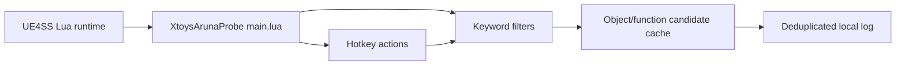

# Aruna UE4SS Probe Design

Last updated: 2026-07-01

## Goal

Build a first-stage diagnostic probe for `Aruna and the Labyrinth of SealedLewd1.207` so the project can discover the game's real Unreal Engine objects, functions, and event flow before creating a formal XToys webhook bridge.

This stage intentionally does not send XToys webhook payloads and does not alter game state. Its only output is structured local diagnostic logging.

## Current Context

`Aruna and the Labyrinth of SealedLewd1.207` is a packaged Unreal Engine game, not a Unity game. The runtime log reports Unreal Engine `5.1.1-23901901+++UE5+Release-5.1`, and the game uses the usual packaged layout:

```text
Aruna and the Labyrinth of SealedLewd1.207/
  ArunaLOSL.exe
  ArunaLOSL/
    Binaries/Win64/ArunaLOSL.exe
    Content/Paks/
    Saved/Logs/ArunaLOSL.log
  Engine/
```

The existing `DominatePlanBridge.BepInEx` plugin cannot be reused directly because BepInEx targets Unity/Mono games. The reusable design ideas are the staged workflow, formal bridge/probe separation, stable local logs, conservative event discovery, and eventual fixed XToys payload protocol.

## Selected Approach

Use UE4SS as the Unreal injection and scripting environment, with a Lua mod named `XtoysArunaProbe`.

The probe will be installed as:

```text
ArunaLOSL/Binaries/Win64/
  UE4SS files
  Mods/
    mods.txt
    XtoysArunaProbe/
      enabled.txt
      scripts/
        main.lua
```

The repository will keep the source version under:

```text
src/ArunaProbe.UE4SS/
  README.md
  Mods/
    XtoysArunaProbe/
      enabled.txt
      scripts/
        main.lua
```

The actual UE4SS runtime files are not committed or generated by this probe. If UE4SS is not already present in the game directory, installation is a separate manual/download step.

## Probe Responsibilities

`main.lua` is responsible for:

- resetting and appending to `xtoys_aruna_probe_log.txt`
- writing a startup banner with probe version and timestamp
- registering hotkeys for manual discovery actions
- scanning loaded UObject names and classes for relevant keywords
- recording newly created relevant objects when UE4SS exposes them
- recording candidate function names suitable for later `RegisterHook` experiments
- deduplicating log lines so repeated scans remain readable

The probe should prefer observation over hooks in its first implementation. It may register non-invasive hooks only when the function name is known and the hook body only logs arguments/object names.

## Discovery Keywords

The first scan uses case-insensitive keyword matching against object full names, class names, and function names:

```text
Aruna
Damage
Hit
Grab
Grapple
Catch
Worm
Attach
Detach
Orgasm
Climax
Ejac
Milk
Nipple
Suit
Break
Core
Energy
Shell
HP
Health
```

These keywords reflect the game's readme and expected gameplay systems: player damage, capture/attachment, body or suit state, resource state, and climax-like events.

## Hotkeys

The probe should use function keys that do not conflict with the DominatePlan bridge convention:

- `F6`: dump candidate UObject and function summary
- `F7`: dump current player/controller/pawn related objects when discoverable
- `F9`: reset the probe log and write a fresh startup banner

If a hotkey is unavailable in UE4SS or conflicts with the game, the implementation may move it to the nearest unused function key and must document the change in `README.md`.

## Log Protocol

The primary log file is:

```text
Aruna and the Labyrinth of SealedLewd1.207/xtoys_aruna_probe_log.txt
```

If UE4SS Lua cannot reliably write to the game root, the fallback log path is:

```text
ArunaLOSL/Binaries/Win64/Mods/XtoysArunaProbe/xtoys_aruna_probe_log.txt
```

Every line starts with local time, category, and message:

```text
[04:52:10.123] [READY] Xtoys Aruna Probe ready
[04:52:11.456] [OBJECT] class=... name=...
[04:52:12.789] [FUNCTION] owner=... function=...
[04:52:13.012] [PLAYER] controller=... pawn=...
[04:52:14.345] [ERROR] ...
```

The log should avoid payload spam. Repeated object/function names are logged once per run unless the user resets the log.

## Data Flow



## Error Handling

The probe must be resilient to missing UE4SS APIs. Each optional API call should be guarded so a failure logs `[ERROR]` and the rest of the probe continues.

The probe must tolerate nil objects, invalid names, and objects that disappear during iteration. Logging helpers should convert values defensively rather than assuming Unreal object methods always succeed.

## Testing And Verification

Static verification:

- ensure `main.lua` contains no webhook URL or network dispatch
- ensure `main.lua` contains the expected hotkey labels and keyword list
- ensure the README documents install path, hotkeys, and expected log file

Runtime verification:

- install UE4SS into `ArunaLOSL/Binaries/Win64`
- copy the mod folder into `Mods/XtoysArunaProbe`
- enable the mod in `Mods/mods.txt`
- launch the game manually
- confirm `xtoys_aruna_probe_log.txt` is created
- press `F6` and confirm candidate object/function lines appear
- press `F7` in gameplay and confirm player/controller/pawn context appears when available
- press `F9` and confirm the log resets

Launching the game from the terminal requires explicit user approval.

## Out Of Scope

- XToys webhook dispatch
- F8 settings panel
- formal hit/climax payload mapping
- native C++ UE4SS mod
- modifying `.pak`, `.ucas`, or `.utoc` game content
- automatic game launch

## Next Stage

After a probe log captures candidate event names and object paths, the next design can create the formal Aruna bridge. That bridge should preserve the DominatePlan protocol where practical:

- formal bridge separate from probe
- local bridge log separate from probe log
- webhook ID normalization
- dispatch disabled by default
- fixed-slot batched hit payloads if body-part events can be identified
- immediate climax payloads when a reliable climax event is found
